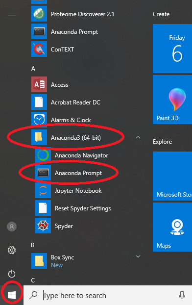
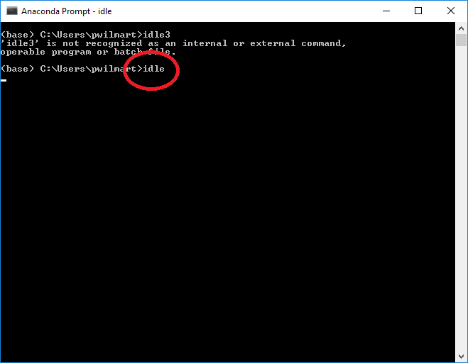
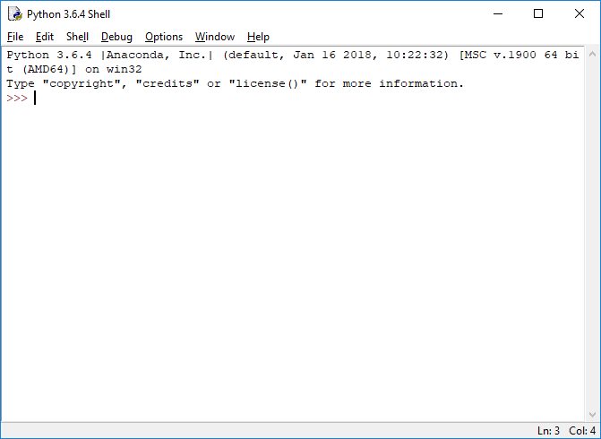
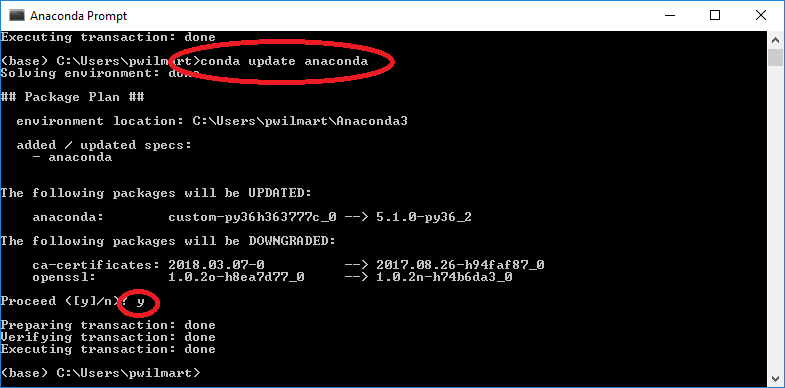

# Anaconda Scientific Python installation

Python is available from several sources, and comes in two flavors: older Python 2.x and newer Python 3.x. It is already installed on Macs, for example. Python 3.x (3.6 at the time this was written) is what the PAW pipeline uses. Python is an expressive, modern computer language, and has become the top computer language. Python includes an extensive standard library that adds much functionality. What is included in the standard library is very conservative and many powerful packages for scientific applications are, unfortunately, not included. The challenge of maintaining several Python extension packages has resulted in scientific Python distributions, such as [Anaconda](https://www.anaconda.com/what-is-anaconda/). The Anaconda Python 3.6 distribution is recommended for the PAW pipeline.

The first pipeline steps of converting RAW files and running Comet require Windows 7 or Windows 10 systems, so Anaconda 3.6 for Windows (typically 64-bit) has to be installed on the computer where these processing steps will take place. If there are other computers used to perform any downstream PAW pipeline steps, they will also need Anaconda 3.6 installations. There are issues with non-Windows systems accessing NTFS-formatted hard disks. Files can be often be read but not written. Files can be copied to non-NTFS formatted volumes, or drivers like [Paragon NTFS for Mac](https://www.paragon-software.com/ufsdhome/store/ntfs-mac/) can be used.

The Anaconda [download link](https://www.anaconda.com/download/#windows) has options for Windows, Mac, and Linux versions, and for Python 3.6 or Python 2.7 versions (as of 2018-04-06). You should get the Python 3.6 download:

 

Follow the installation instructions for your platform. On Windows, Anaconda programs will be added to your start menu. There are many different ways to run Python programs on most systems. Python tutorials and books usually have some discussions of the different ways. This [short video](https://www.youtube.com/watch?v=IZj8hLrkABs) covers a few ways. Anaconda has [online documentation](https://docs.anaconda.com/anaconda/) about the distribution and the [Anaconda Navigator](https://docs.anaconda.com/anaconda/navigator/) GUI environment. The [Spyder IDE](https://pythonhosted.org/spyder/) is fine for launching scripts and great if you want to do some Python coding.

I prefer an integrated development environment (IDE) that is part of the Python standard distribution called [IDLE](https://docs.python.org/3/library/idle.html). IDLE has been around for years and does the basics in a clean way. Since Anaconda includes more modern IDE tools, figuring out how to launch IDLE is not so obvious in Anaconda. It is best to launch IDLE from a command line environment with some additional Python paths defined, called `Anaconda Prompt`:

In the console window that will launch, type `IDLE` and hit the RETURN key.

The IDLE console window should appear:

The Python version information should indicate an Anaconda distribution and a Python 3.x version number. See the [documentation on IDLE](https://docs.python.org/3/library/idle.html) for a rather dry description of features. There are other [tutorials](https://www.cs.uky.edu/~keen/help/python-tutorial/Lab0.html), and [short](https://www.youtube.com/watch?v=lBkcDFRA958) and [longer](https://www.youtube.com/watch?v=2Thymdugfp4) YouTube videos available. Just keep in mind that IDLE is a more integral part of the Python distributions from [python.org](https://www.python.org/). The IDLE features that I like are that you will have a single Python console window where you can execute Python statements. This is also where standard input, output, and error messages go. You can have multiple source code windows open. There is nice statement highlighting, indenting, and auto completion. The interactive debugger is also nice. An advantage over running from a Windows command shell is that console (program) output will persist.

One of main the reasons to use a scientific Python distribution like Anaconda, is maintaining all of the installed packages. Anaconda includes the [Conda](https://conda.io/docs/) package manager and Anaconda should be updated occasionally. This is best done with two command line calls, the first updates Conda itself, then Anaconda is updated:

  
