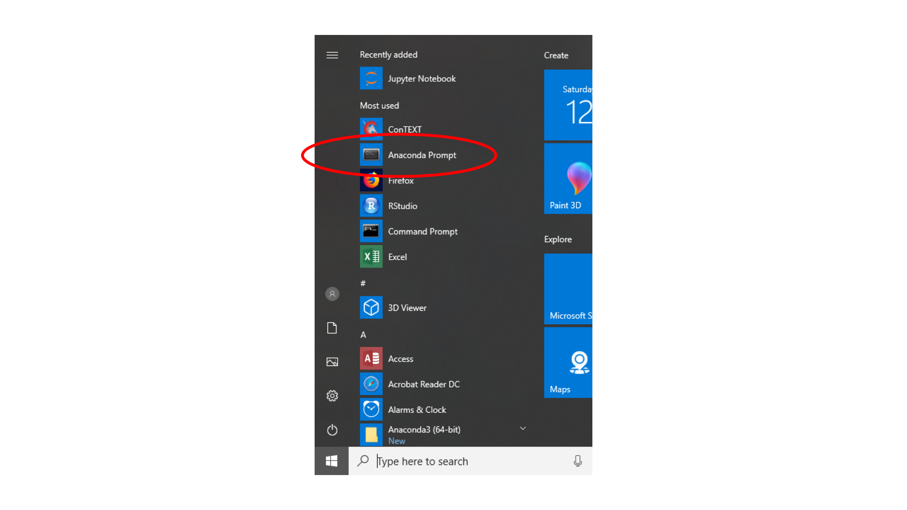
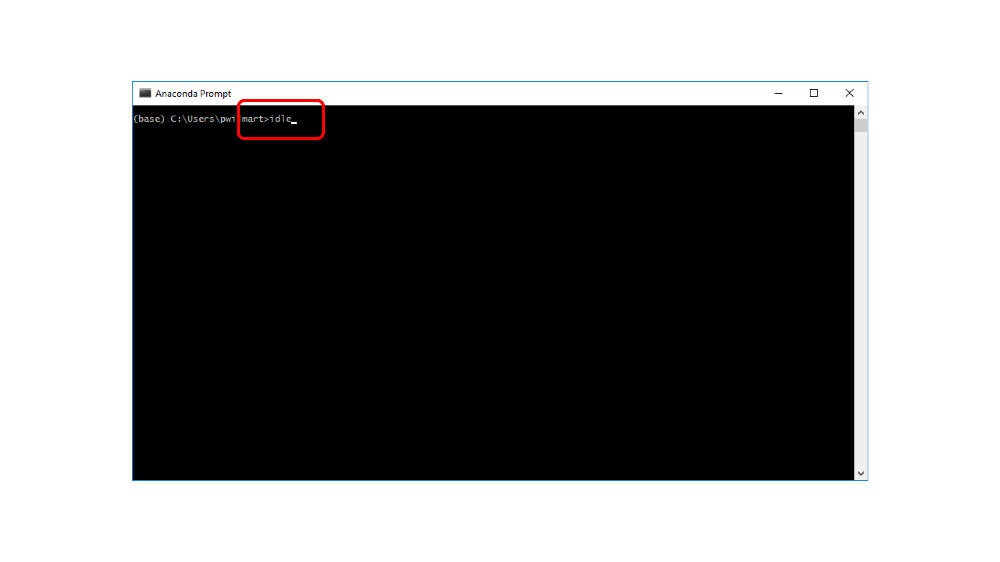
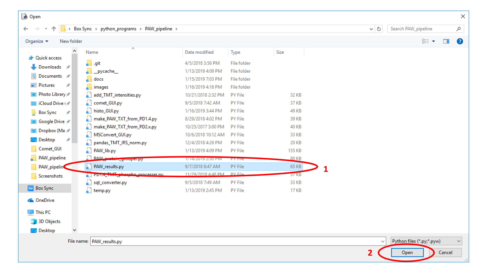
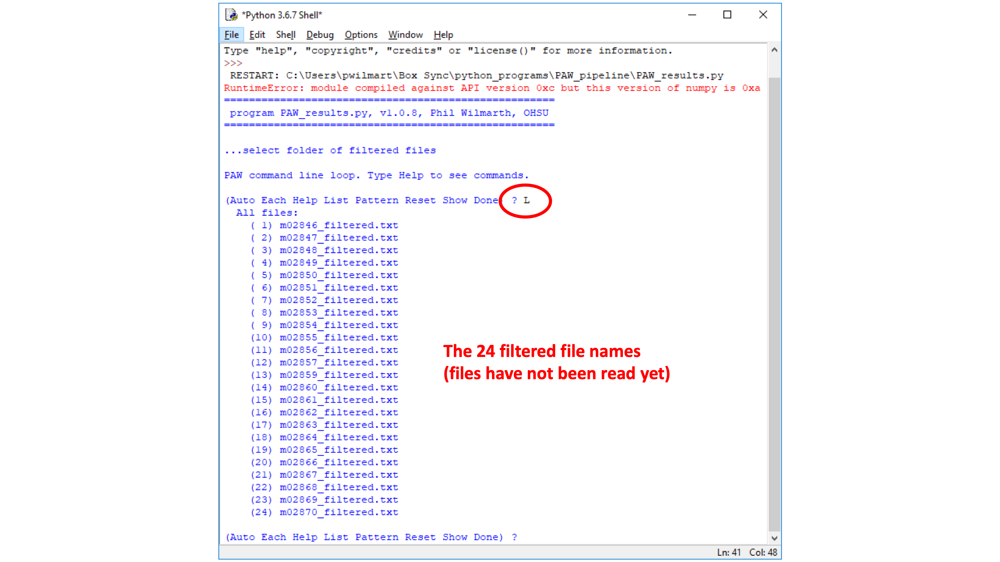
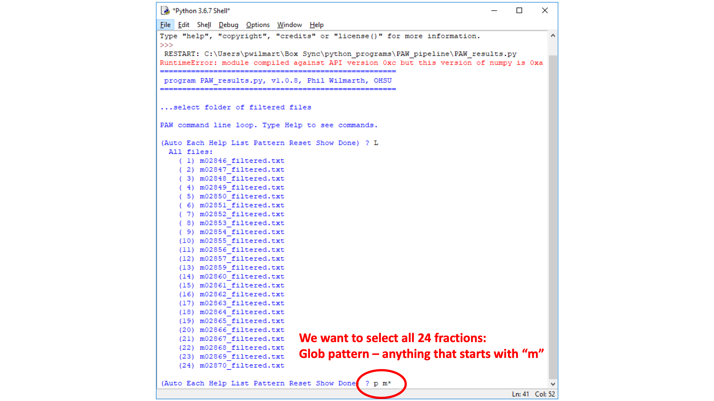
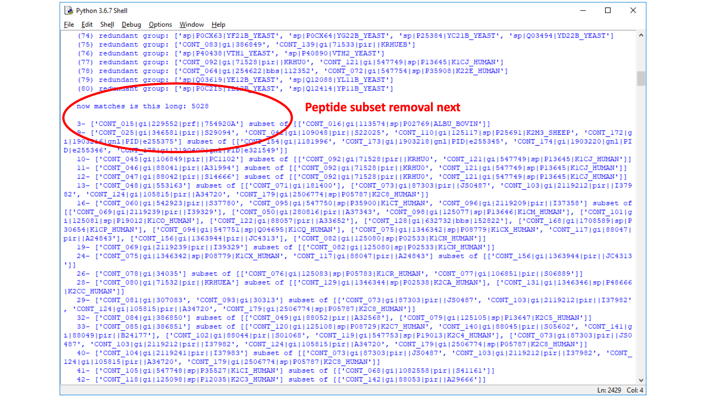
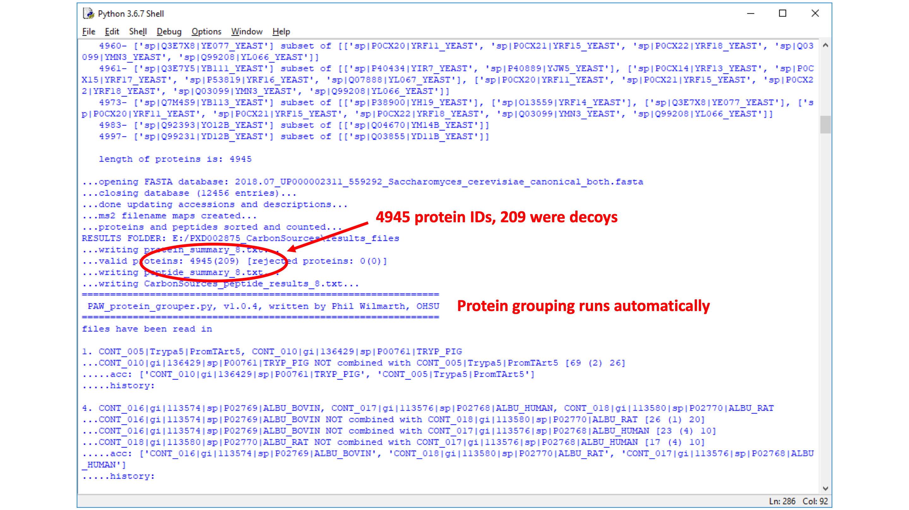
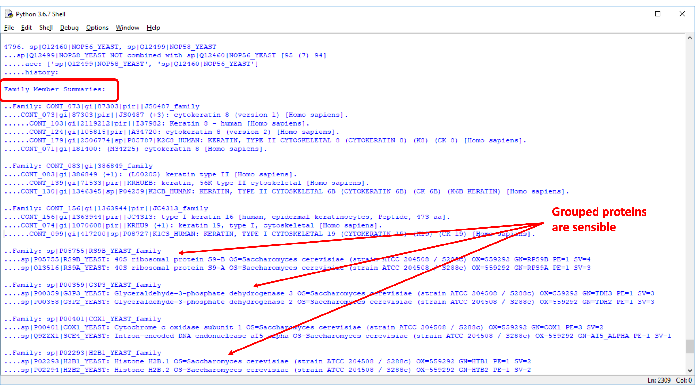

Start an Anaconda Prompt window

---



Type the command `idle` and press return.

---


This will launch the IDLE programming environment. From the IDLE console window, select the `Open...` command from the `File` menu.

---



Select the `PAW_results.py` script from the location where you have the PAW pipeline scripts from the file browser dialog box. Then click the `Open` button in the lower right corner.

---


There are a couple of parameters that you might want to occasionally change. Two peptides per protein is a **HIGHLY recommended** setting. Sometimes you may need single peptide per protein IDs. The PAW pipeline does not have any explicit protein FDR algorithms. There is a one-to-one relationship between incorrect PSMs and incorrect proteins when using a one peptide per protein setting. Sometimes semi-tryptic or non-tryptic peptides are important. The “minimum_ntt_per_peptide” parameter would need adjustment in those cases.

---


Run the script (`Run Module` command from the `Run` menu).

---


The IDLE console windows indicates that a folder dialog box has been popped up for “filtered_files” folder selection.

---


Browse to the `filtered_files` folder inside your project folder. Select the folder and then click the `Select Folder` button.

---


All of the filtered top hit summary files are parsed and a simple command interpreter is started. This allows assigning the RAW files to the biological samples. Many experiment have multiple biological samples. Shotgun analysis of biological samples often requires multiple dimensions of separation, so several RAW files might correspond to single biological samples. We have the “Help” information on this slide. The pattern matching is like most file system [glob pattern](https://en.wikipedia.org/wiki/Glob_(programming)) matching.


---



---



---


---


---


---


---


---



---



---


---



---


---


---


---


```
(Auto Each Help List Pattern Reset Show Done) ? help

Commands: Auto, Each, Help, List, Pattern, Reset, Show, Quit.
(commands are not case sensitive and first letter is sufficient.)

...Auto: automatically parse the sample names from the filenames,
...Each: treat each filename as a separate sample,
...Help: prints this message,
...List: lists all of the (remaining) filename(s),
...Pattern pattern: glob-style search pattern to get a subset of filenames
      ("*" or "*.*" is all files,
       "*.txt" is all files that have a "txt" extension,
       "a*" is all files that start with the letter "a",
       "*string*" is all files that contain "string", etc.),
...Reset: start over,
...Show: print the current samples and associated files [verbose],
...Done: exit from the command loop and return to processing.
```
