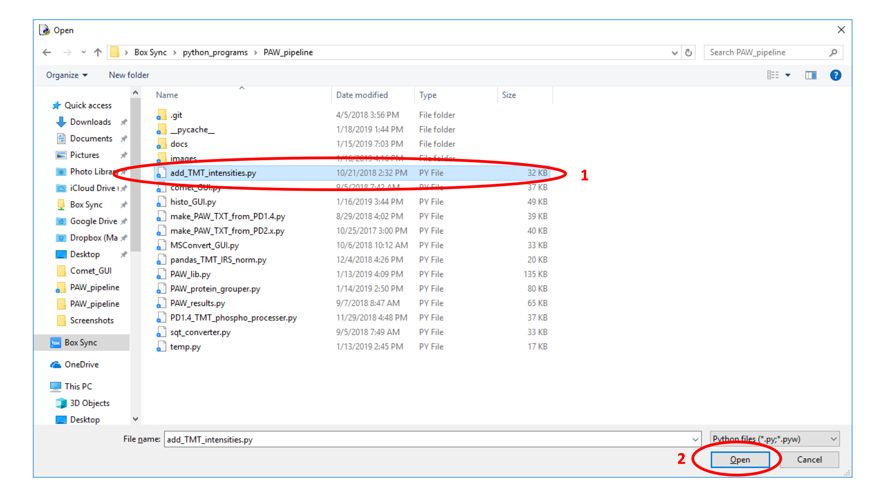
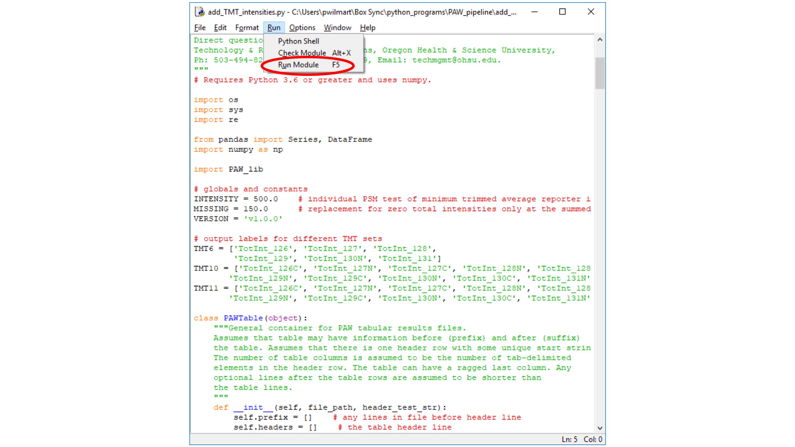
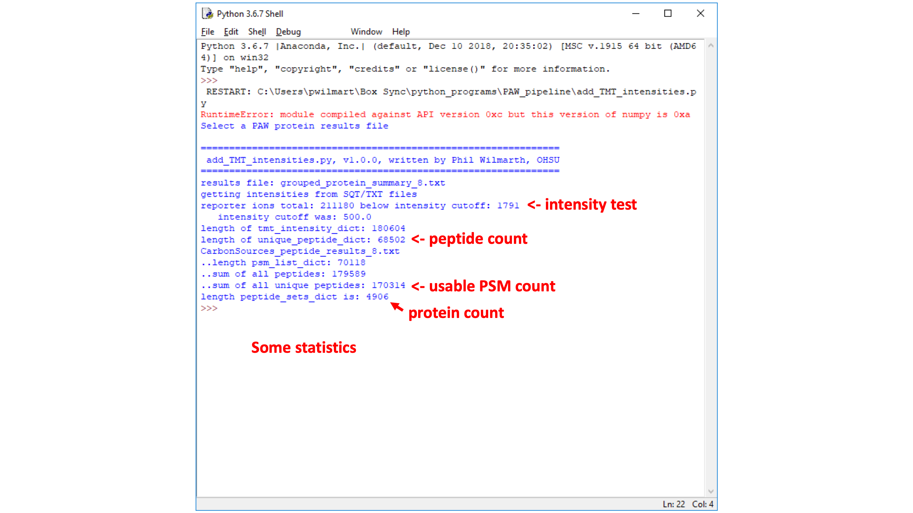
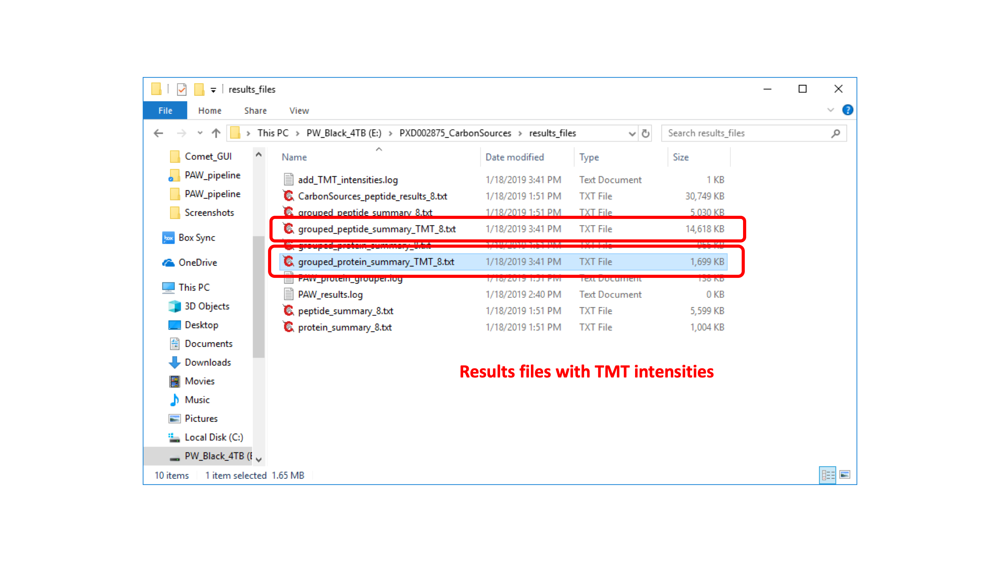

# add_TMT_intensities.py script

This script adds reporter ions to the PAW results files. It reads PAW protein summary files and associated peptide files to determine which PSMs are unique to the final list of proteins as reported in the summary file. Only unique PSMs are used for quantification. There is some minimum average intensity level filtering applied at the PSM level. There is also replacement of zero intensity values at the final protein level with a user set value. The script does peptide and protein level aggregations, and writes new protein and peptide summary files with reporter ion intensities.

### Step-by-step Example, continued

This is analysis of a public dataset (PRIDE [PXD002875](https://www.ebi.ac.uk/pride/archive/projects/PXD002875)) from Paulo, O'Connell, Gaun, and Gygi:

> Paulo, J.A., O’Connell, J.D., Gaun, A. and Gygi, S.P., 2015. Proteome-wide quantitative multiplexed profiling of protein expression: carbon-source dependency in Saccharomyces cerevisiae. Molecular biology of the cell, 26(22), pp.4063-4074.

There were 24 RAW files of yeast grown in three different carbon sources. It was a 3x3 (9-plex) TMT experiment done with the SPS MS3 (MultiNotch) method.

---

Open the script from IDLE in the usual way.

---

Browse to the location of the PAW scripts on your system, select the `add_TMT_intensities.py` script, and then click the `Open` button.

---

There are two parameters that can be changed. In SPS MS3 data from Fusion instruments, the smallest non-zero intensities (reporter ion peak heights) are about 330. We have a trimmed average intensity test against the `INTENSITY` threshold. The trim removes the most intense and the least intense reporter ion, averages the rest and tests against `INTENSITY`. A test value of 500 is about as low as one would want to use. The number of missing data points will drop off pretty rapidly as the `INTENSITY` cutoff is raised.

> NOTE: MS2 reporter ions will have different ranges of intensity values and the cutoff value may need adjustment. The reporter ion intensity files created from the RAW files can be inspected to see what the ranges of intensities are.

The `MISSING` value is what is used to replace zeros after the data have been aggregated to the final protein values. See [this post](https://pwilmart.github.io/blog/2018/12/12/TMT-zero-replacement) for a discussion of missing data imputation in isobaric labeling datasets.

---

Run the script in the usual IDLE way (`Run Module` command from the `File` menu).

---

A dialog box will appear to allow selection of the protein results file.

---

Select the appropriate protein results file from `results_files` folder. The grouped file (`grouped_protein_summary_8.txt`) is recommended for most applications; however, the script can use the regular report files (`protein_summary_8.txt`), too. Then click the `Open` button.

---

The script will read the protein and peptide files, determine the usable peptides (unique to the final protein list), and aggregate the PSM data up to the peptide and protein levels. The aggregated reporter ion intensities are added to the protein and peptide result files.

---

New results files (`grouped_protein_summary_TMT_8.txt` and `grouped_protein_summary_TMT_8.txt`) with additional TMT reporter ion intensity columns have been created.

> There is a `CarbonSources_results_files` folder inside the `docs` folder in the repository that has the results files created during this example. Your results may not be 100% identical because your thresholds set during the histo_GUI step may not have been exactly the same as mine. Results should be very similar, however.
