# histo_GUI.py script
The majority of this application was written by Billy Rathje as a 2014 summer project while he was attending the University of Puget Sound.

The target/decoy method was ground breaking for false discovery rate (FDR) control in proteomics experiments.

> Moore, R.E., Young, M.K. and Lee, T.D., 2002. Qscore: an algorithm for evaluating SEQUEST database search results. Journal of the American Society for Mass Spectrometry, 13(4), pp.378-386.

> Elias, J.E. and Gygi, S.P., 2007. Target-decoy search strategy for increased confidence in large-scale protein identifications by mass spectrometry. Nature methods, 4(3), p.207.

This enabled empirical counting of incorrect peptide-spectrum matches (PSMs) and direct calculations of FDR. Score histograms for matches to target sequences and for matches to decoy sequences can be constructed, overlaid, and score thresholds determined by inspection. Many factors affect search engine scores and score distributions; such as, peptide charge state, number of basic residues, types of modifications, fragmentation methods, etc. Large datasets may need to be subdivided into many peptide classes and FDR applied by class. A graphical user interface application is key.

This approach was first described in [this publication](https://link.springer.com/article/10.1007/s12177-009-9042-6) from 2009. Support for accurate masses and better FDR control for modifications were motivations for the GUI application. In a departure from most other methods, accurate mass information is used to first distinguish correct from incorrect matches and create conditional score histograms. The order of filter steps matter. Understanding this approach is best done by analyzing data. It is intuitive in practice, but challenging to describe out of context.

We will continue our analysis of the yeast data (PRIDE [PXD002875](https://www.ebi.ac.uk/pride/archive/projects/PXD002875)) from Paulo, O'Connell, Gaun, and Gygi:

> Paulo, J.A., O’Connell, J.D., Gaun, A. and Gygi, S.P., 2015. Proteome-wide quantitative multiplexed profiling of protein expression: carbon-source dependency in Saccharomyces cerevisiae. Molecular biology of the cell, 26(22), pp.4063-4074.

**Application overview:**
- load Comet results
- compute deltamass histograms and set windows
- build conditional score histograms
- set score thresholds to control FDR
- filter Comet results

---

From a Python 3 IDLE application, open the `histo_GUI.py` script in the usual way.

---

Select the script and click the `Open` button.

---

From the code window, run the module (F5 key).

---

The GUI starts with a setup dialog window. Click the `Select Top Hit Summary Files` button to load in the Comet results.

---

Use the file dialog window to browse to and open the `msn_files` folder.

---

Do a multi-file selection of all (24 files) of the top hit summary `.txt` files. Do not select any of the `.PAW_tmt.txt` files. Click the `Open` button.

---

The focus will return to the setup dialog. The two middle widgets are pull down menus. The histograms can be unsmoothed (Standard Plots) or smoothed. The instrument can be High Resolution (Orbitraps) or Low Resolution (regular ion traps). High resolution instruments are assumed to have data with 2+, 3+, and 4+ peptide charge states. Low Resolution instruments have 1+, 2+ and 3+ charge states. The default settings are usually correct. When the data has been selected and the settings are correct, click the `Load and Plot Histograms` button.

---

The IDLE console window will show file loading progress and then a few key features of the search parameters. The setup GUI dialog will go away and a new GUI window will appear.

---

The deltamass histogram window has several elements.

---  

There are two buttons at the very top. Below the buttons are the tabs of the three windows. They are labeled `2+_DM`, `3+_DM`, and `4+_DM`. The `2+_DM` tab is visible. There are three deltamass histograms in the center of the window. The one on top is a full parent ion tolerance width view. The bottom left plot is an expanded view of the 0-Da region (the main peak). The bottom right plot is an expanded view of the 1-Da region. The scales are in Da because that has physical meaning. PPM is an autoscaled ratio that is not really a proper measure of mass, although it has utility in some contexts. Below the plots is a multi-column, scrollable deltamass table widget. There are columns that have target and decoy counts (one set is unsmoothed, the other set is smoothed).

---

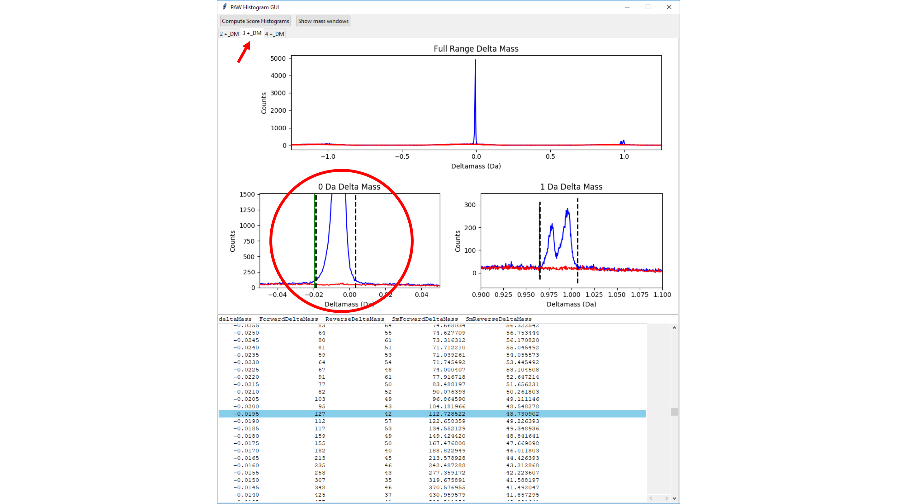

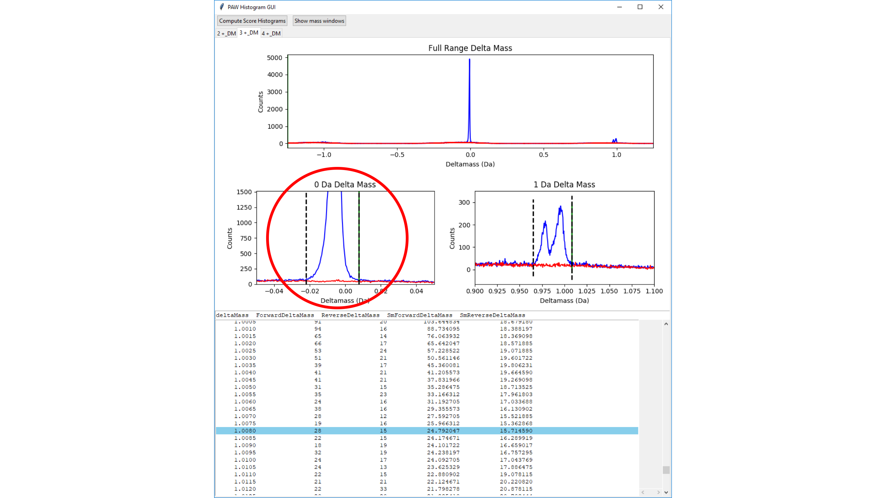

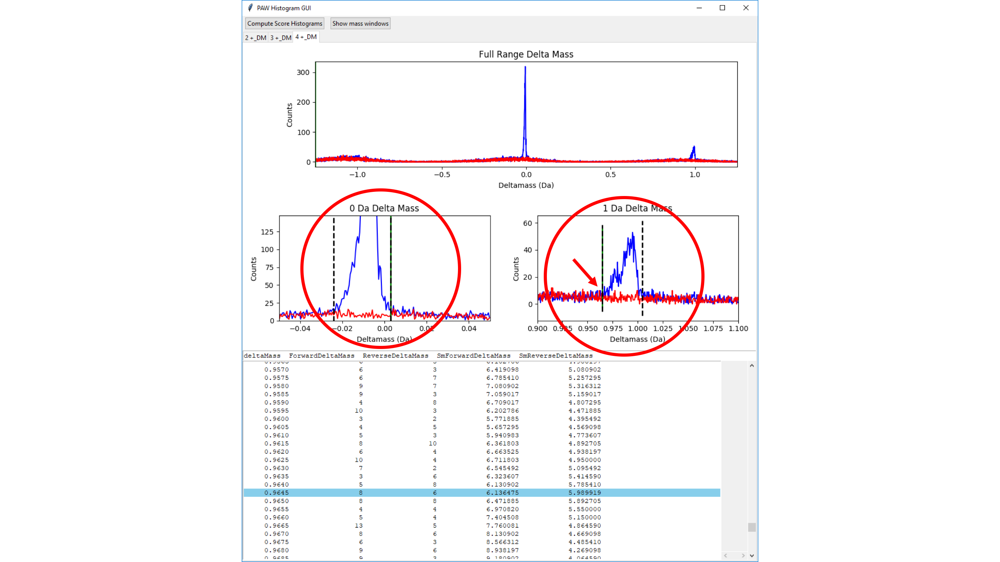

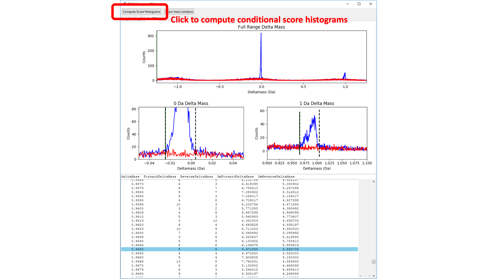

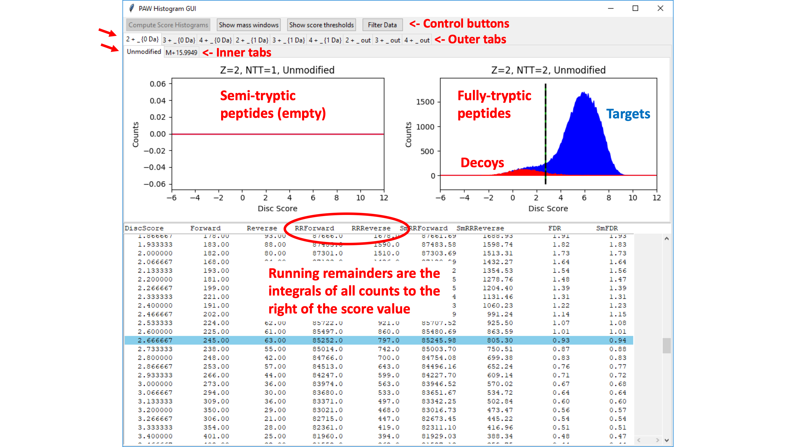

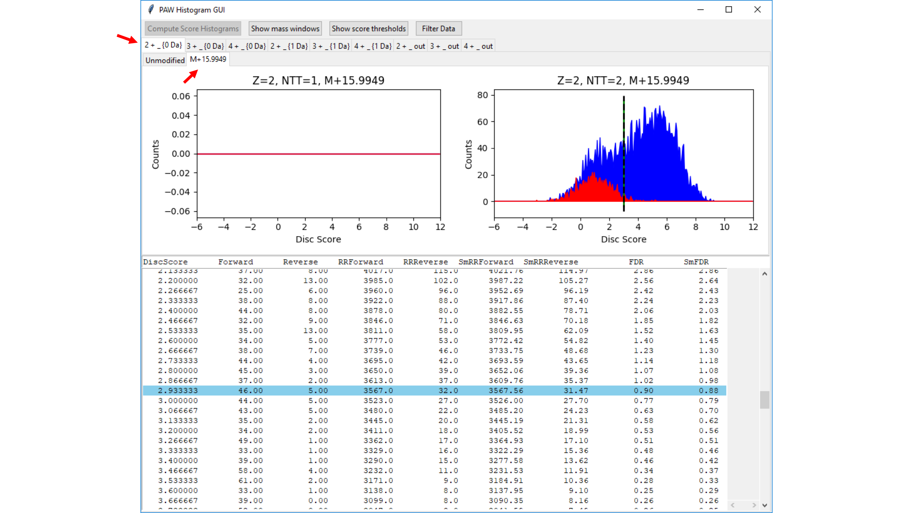

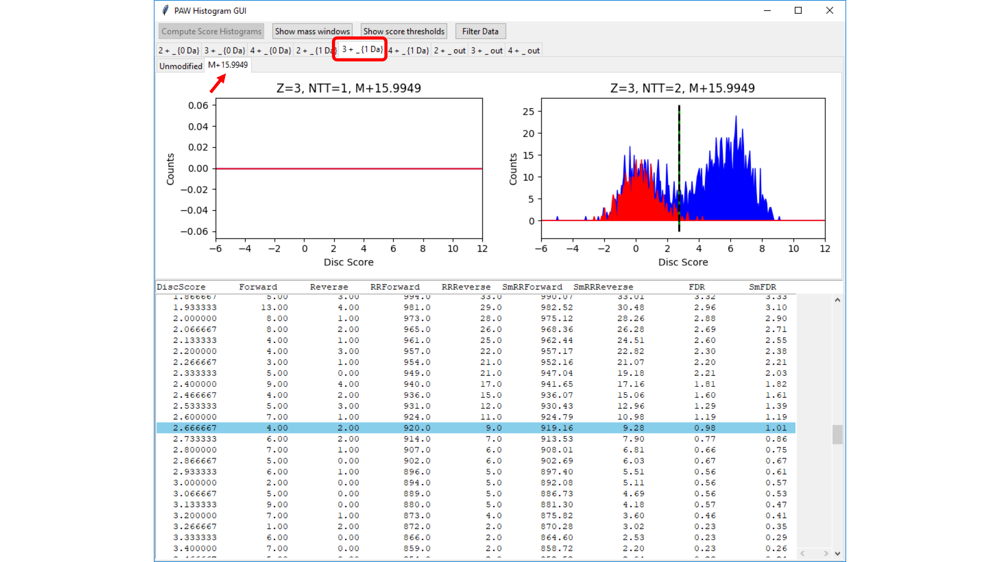

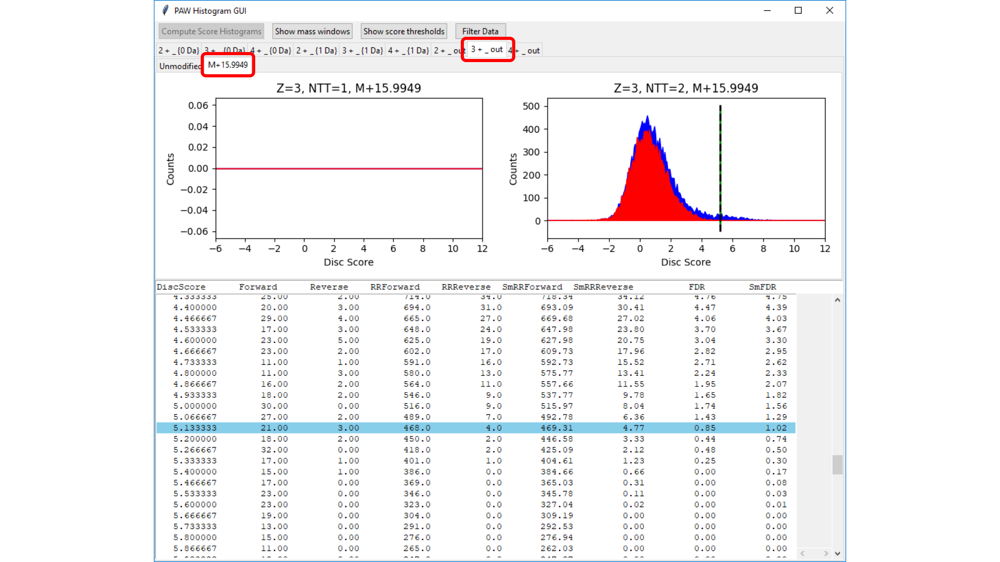

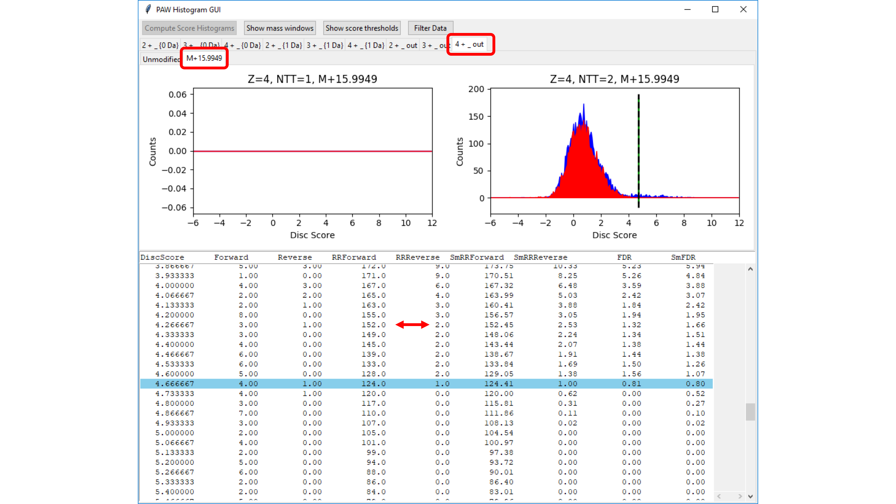

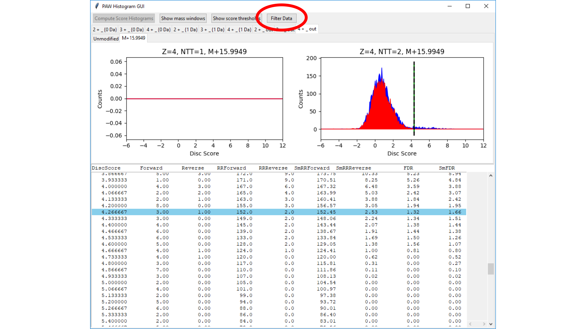

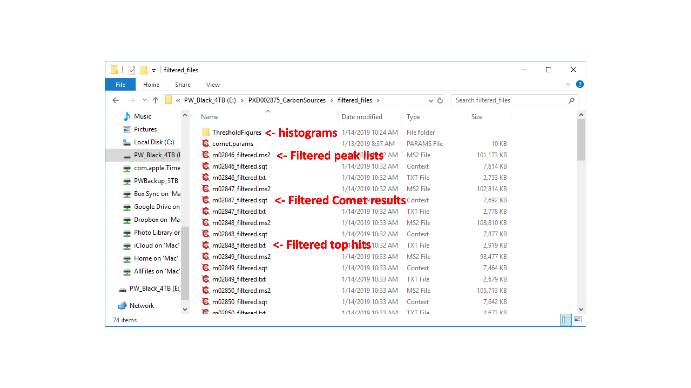
