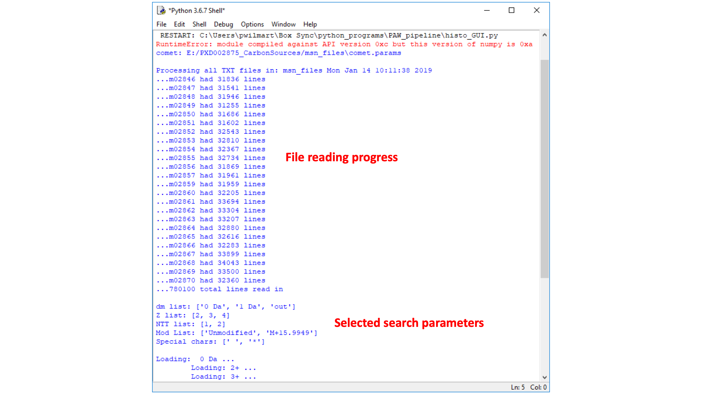
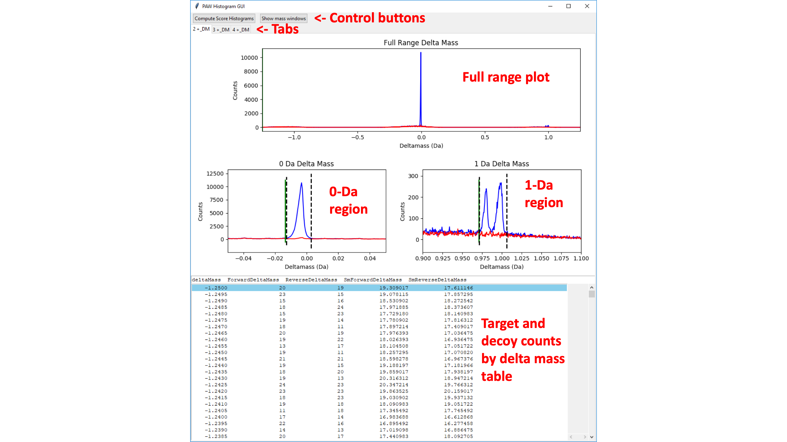
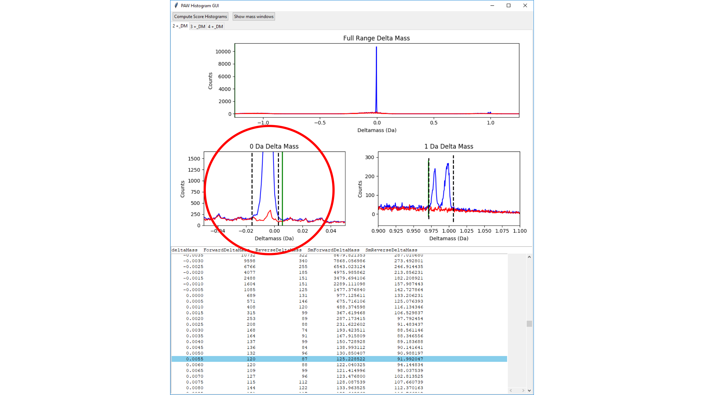
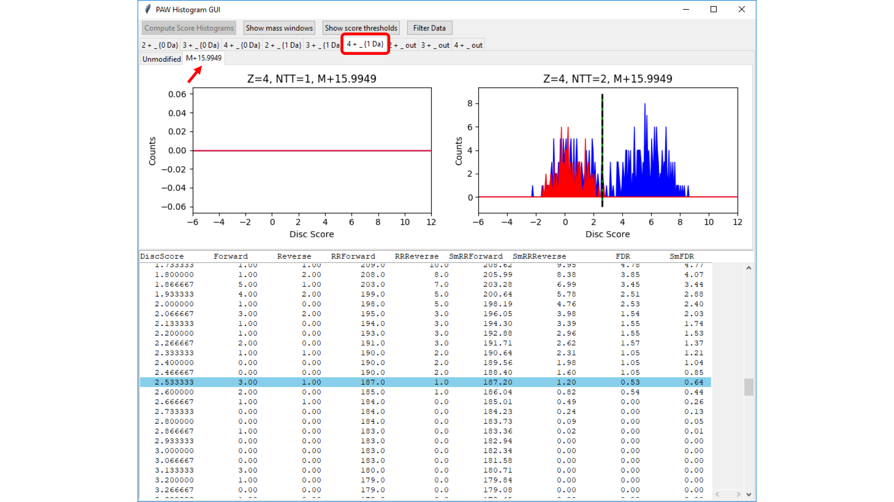
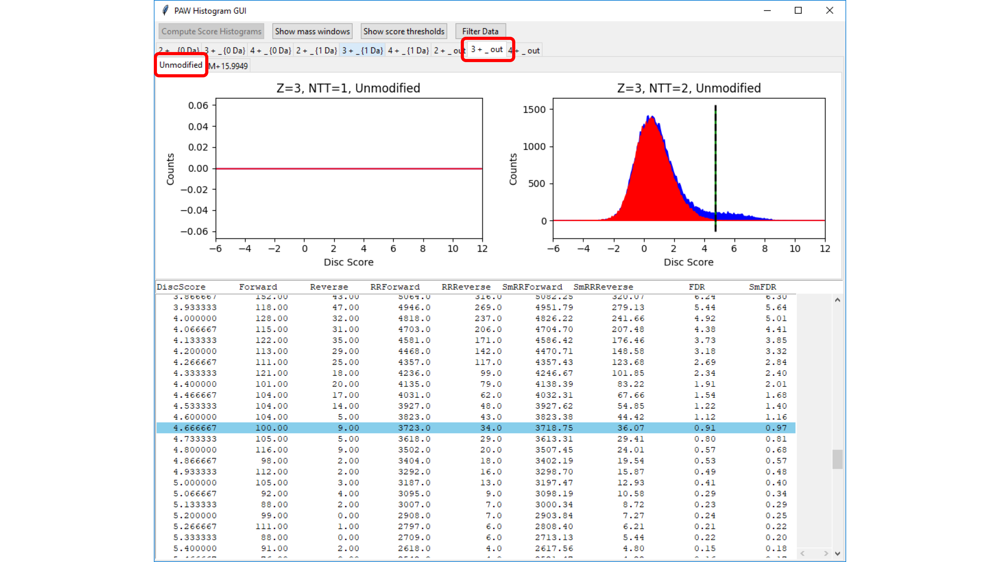
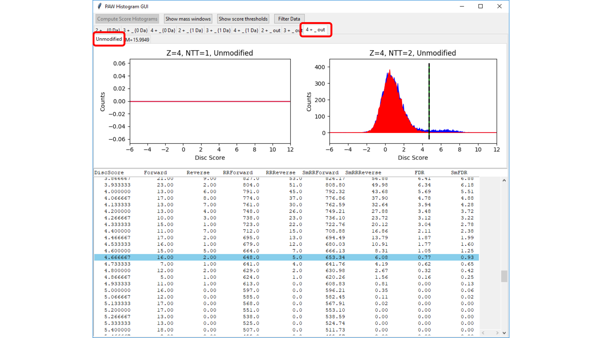
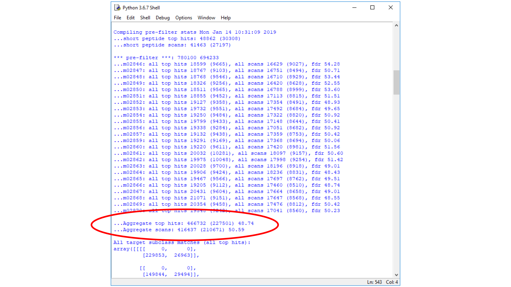

# histo_GUI.py script
The majority of this application was written by **Billy Rathje** as a 2014 summer project at OHSU while he was an undergraduate student at the University of Puget Sound.

The target/decoy method was ground breaking for false discovery rate (FDR) control in proteomics experiments.

> Moore, R.E., Young, M.K. and Lee, T.D., 2002. Qscore: an algorithm for evaluating SEQUEST database search results. Journal of the American Society for Mass Spectrometry, 13(4), pp.378-386.

> Elias, J.E. and Gygi, S.P., 2007. Target-decoy search strategy for increased confidence in large-scale protein identifications by mass spectrometry. Nature methods, 4(3), p.207.

This enabled empirical counting of incorrect peptide-spectrum matches (PSMs) and direct calculations of FDR. Score histograms for matches to target sequences and for matches to decoy sequences can be constructed, overlaid, and score thresholds determined by inspection. Many factors affect search engine scores and score distributions; such as, peptide charge state, number of basic residues, types of modifications, fragmentation methods, etc. Large datasets may need to be subdivided into many peptide classes and FDR applied by class. A graphical user interface application is key.

This approach was first described in [this publication](https://link.springer.com/article/10.1007/s12177-009-9042-6) from 2009. Support for accurate masses and better FDR control for modifications were motivations for the GUI application. In a departure from most other methods, accurate mass information is used to first distinguish correct from incorrect matches and create conditional score histograms. The order of filter steps matter. Understanding this approach is best done by analyzing data. It is intuitive in practice, but challenging to describe out of context.

We will continue our analysis of the yeast data (PRIDE [PXD002875](https://www.ebi.ac.uk/pride/archive/projects/PXD002875)) from Paulo, O'Connell, Gaun, and Gygi:

> Paulo, J.A., O’Connell, J.D., Gaun, A. and Gygi, S.P., 2015. Proteome-wide quantitative multiplexed profiling of protein expression: carbon-source dependency in Saccharomyces cerevisiae. Molecular biology of the cell, 26(22), pp.4063-4074.

**Application overview:**
- load Comet results
- compute deltamass histograms and set windows
- build conditional score histograms
- set score thresholds to control FDR
- filter Comet results

---

From a Python 3 IDLE application, open the `histo_GUI.py` script in the usual way.

---

Select the script and click the `Open` button.

---

From the code window, run the module (F5 key).

---

The GUI starts with a setup dialog window. Click the `Select Top Hit Summary Files` button to load in the Comet results.

---

Use the file dialog window to browse to and open the `msn_files` folder.

---

Do a multi-file selection of all (24 files) of the top hit summary `.txt` files. Do not select any of the `.PAW_tmt.txt` files (those have reporter ion intensities). Click the `Open` button.

---

The focus will return to the setup dialog. The two middle widgets are pull down menus. The histograms can be unsmoothed (Standard Plots) or smoothed. The instrument can be High Resolution (Orbitraps) or Low Resolution (regular ion traps). High resolution instruments are assumed to have data with 2+, 3+, and 4+ peptide charge states. Low Resolution instruments have 1+, 2+ and 3+ charge states. The default settings are usually correct. When the data has been selected and the settings are correct, click the `Load and Plot Histograms` button.

---

The IDLE console window will show file loading progress and then a few key features of the search parameters. The setup GUI dialog will go away and a new GUI window will appear.

---

The deltamass histogram window has several elements.

---  

There are two buttons at the very top. Below the buttons are the **tabs** of the three windows. They are labeled `2+_DM`, `3+_DM`, and `4+_DM`. The `2+_DM` tab is visible. There are three deltamass histograms in the center of the window. The one on top is a full parent ion tolerance width view. The bottom left plot is an expanded view of the 0-Da region (the main peak). The bottom right plot is an expanded view of the 1-Da region. The scales are in Da because that has physical meaning. *PPM is an autoscaled ratio that is not really a proper measure of mass, although it has utility in some contexts.* Below the plots is a multi-column, scrollable deltamass table widget. There are columns that have target and decoy counts (one set is unsmoothed, the other set is smoothed).

---

The GUI also has some functionality. The histogram plots can be vertically expanded or contracted with left or right **double mouse clicks**, respectively. The pairs of dotted lines define inclusive windows for each of the 0-Da and 1-Da regions. Any PSMs with deltamasses inside of the dotted lines in the 0-Da window will be used to create conditional 0-Da score histograms, for example. The locations of the dotted lines to capture their respective peaks can be adjusted.

There are three plots and one table. By clicking in different plots, you will trigger an update to the table to show the data for that plot. The procedure to change the dotted lines in the plots has a few steps. **First**, click inside of the plot that you want to work on. **Second**, click inside of the table. GUI programming has to manage widgets and the application has to know what widget is the one with "focus". We need to get focus moved from the plot to the table. We do that by clicking on the table.

Once the table has focus, we will have bindings to some of the keyboard keys, specifically the cursor arrow keys. The pairs of dotted lines define left and right thresholds for the deltamass windows. The **left and right arrow keys** select the respective dotted lines. To adjust the left dotted lines, press the left arrow key. Once a specific threshold has been picked, a solid green line appears. The location of the green line changes in response to which table row is selected (blue highlighting). You can click directly on a table row or move the highlighting up or down in the table using the **up and down arrow keys**. When the green line is where you want the new threshold to be positioned, press the return key. The dotted line should move on top of the green line.

You cannot break your data with the GUI interface. You can always close the GUI window and start over. Expand plots and change thresholds until the interface makes sense.

---

We have expanded the scale for the 0-Da region plot by double-left-mouse clicking. We see that the dotted lines should be a little wider to capture the entire peak. We want to have the left dotted line be where the peak just starts to come up from the baseline. We have already moved the left dotted line to its new location. We are in the middle of moving the right dotted line. We have done the steps to get focus on the right dotted line (click in 0-Da plot, click in table, and press the right arrow key). We have used the down arrow key to change the highlighted row to where the solid green line is located. We complete the change by pressing the return key to relocate the right dotted line to the green line.

---

This shows the final result with the wider window for the 0-Da peak.

---

We move to the 3+ peptides by clicking the 3+_DM tab at the top of the window. We have expanded the scale on the 0-Da plot and see that the dotted lines are too narrow. We will go through the same steps as we did for the 2+ peptides and widen the pair of dotted lines.

---

This shows the final result with the wider window for the 3+ 0-Da peak.

---

These are the 4_ peptides. There are many fewer 4+ tryptic peptides, so the data in the histograms have some relatively larger fluctuations. We have adjusted the thresholds in the 0-Da region (the peak is not centered at 0-Da, indicating a small systematic mass calibration issue). The left dotted line in the 1-Da region has also been adjusted. The relative resolution of the 4+ peptides is worse than for 2+ peptides where the two peaks were fully resolved.

---

We have worked through all of the tabs. I recommend working systematically left-to-right to avoid missing any tabs. We have inspected and adjusted the dotted lines so that the peaks at 0-Da and 1-Da are just fully captured (without including too much noise). We are ready to compute the deltamass conditioned score histograms by clicking on the `Compute Score Histograms` button in the top left of the window. The deltamass window will be replaced by a search engine score histogram window.

---

The score histogram window is also a multi-tabbed window with plots and a table. We have two new control buttons at the top. We have two rows of tabs. There are outer tabs in the top row that are the cross (a database term) of charge states and deltamass regions. In addition to the 0-Da region and the 1-Da region, we have histograms for all deltamasses that were **not** in either window. That makes 9 outer tabs in total. The inner tabs cover the different peptide modification states. In this search we have only oxidized Met as a variable modification so we have two modification states: unmodified and oxidized.

We have histogram plots for semi-tryptic peptides (only one end of the peptide consistent with trypsin cleavage rules) on the left and fully tryptic peptides on the right. The instrument only directly determines the C-terminal tryptic site (it is in the peptide). The N-terminal site is not part of the peptide and is inferred based on the protein sequence. Peptides can match to more than one protein. The same peptide can be semi-tryptic for some matches and fully tryptic for other matches. We have used Comet settings and post search processing to exclude any semi-tryptic matches. The left plot will be empty in all tabs for this example.

The histogram for matches to the target protein sequences are filled in blue color. The histograms for matches to the decoy (reversed) sequences are filled in red color. A default cutoff of 1% FDR is computed automatically and is shown by the dotted line in the right plot. Like in the deltamass histograms, we have multiple plots and a single table. The table will update when plots are selected by a mouse click.

The PAW pipeline computes a discriminant score similar to PeptideProphet from the Comet results.

> Keller, A., Nesvizhskii, A.I., Kolker, E. and Aebersold, R., 2002. Empirical statistical model to estimate the accuracy of peptide identifications made by MS/MS and database search. Analytical chemistry, 74(20), pp.5383-5392.

**The table columns are:**

- DiscScore - the discriminant score value
- Forward - histogram counts for target matches
- Reverse - histogram counts for decoy matches
- RRForward - running remainder for target matches (how many above score)
- RRReverse - running remainder for decoy matches
- SmRRForward - smoothed running remainder for target matches
- SMRRReverse - smoothed running remainder for decoy matches
- FDR - false discovery rate at respective score
- SmFDR - smoothed SmFDR

The 1% FDR threshold looks fine. We do not need to change it. The 0-Da window was dominated by a sharp target match peak on top of some low level of noise. We see that reflected in the relative sizes of the blue and red distributions.

---

These are the score distributions for the next inner tab (oxidized Met - M+15.9949). We have fewer overall matches for this peptide class. The 1% FDR cutoff is fine and it is located at a little higher score than for unmodified peptides. The score cutoffs that give similar FDR values can be different for modified peptides compared to unmodified peptides. The shapes and positions of the correct and incorrect distributions are usually similar between unmodified and modified, it is the relative magnitudes of the two distributions that change. We want to set thresholds across the peptide classes that are the same so that our overall final FDR will be our desired value. 1% FDR is often good. Sometimes, depending on the data and experimental design, lower FDR values may be desired. I have never seen data where setting threshold below a 5% FDR made any sense.

---

On to the 3+ unmodified peptides. Everything looks good and we do not have to change the default threshold.

---

These are the oxidized Met 3+ peptides. There are more of them compared to 2+ because 3+ peptides are longer on average and more likely to contain a Met residue. The default threshold location is higher than for the 3+ unmodified peptides.

---

There are far fewer 4+ unmodified peptides. They look fine and the threshold is okay.

---

The 4+ modified peptides are getting quite sparse. The threshold location looks good.

---

We now move from the 0-Da regions to the 1-Da regions as we are working through the outer tabs. These deltamass windows were two peaks (deamidation and first isotopic peak) and the peak sizes were much smaller than the corresponding 0-Da peaks. We expect the signal-to-noise ratio to be lower. We see that the relative size of the red distribution is quite a bit larger.

We can also see that the blue distribution has more scores in the 2 to 4 range. We might expect that deamidated peptides and isotopically enriched peptides could have some higher m/z b- or y-ions that might fall outside of the fragment ion tolerances. The nominal mass tolerances for ion trap fragmentation are more forgiving than narrow windows, but some effect on scoring is to be expected.

The 1% FDR threshold location here is fine.

---

The modified 2+ peptides for the 1-Da region are sparse, but the cutoff looks good.

---

This is the 1-Da conditional score histograms for the 3+ peptides. They are larger on average so both having an apsaragine residue and having a weaker monoisotopic peak are more likely than for 2+ peptides. We see a relatively larger blue distribution. The threshold location looks appropriate.

Everything looks fine for the oxidized Met peptides in this class.

---

The 1-Da region peptides for the 4+ peptides are weaker but everything looks okay.

---

This peptide class is getting quite sparse. We still have nice separation between distributions and the dotted line position is spot on.

---

Now we get into data classes that might be unexpected. These are the peptides that did not appear to have an accurate mass (in the 0-Da region) or an **accurate inaccurate mass** (the 1-Da doublet). How can an Orbitrap have correct PSMs without correct masses? Not all peptides in shotgun experiments are abundant enough to have an easily distinguishable isotopic distribution above the noise level. The traps, through longer accumulation times, can enrich weak peptides and still produce identifiable MS2 spectra. The new instruments also have smart acquisition methods where they do not sit idle. They may take scans of better features first, but if they have nothing else to target due to dynamic exclusion or lower sample complexity, they can give other features a go. The data can be a mixture of peptides with accurate masses and known charge states, and other ions that might have neither but were fragmented as a long shot.

The PAW pipeline is very inclusive and is happy to accept correct PSMs even if they do not have a privileged mass background. We usually do not see a lot of net correct PSMs in this class. We have most of the incorrect peptides (red decoy matches) in these classes. For the 2+ peptide in this **out** class, we have gained about 3000 PSMs at the 1% FDR cutoff.  

---

Here we see the oxidized Met peptides for the 2+ out class. The net correct PSMs above the large red distribution are small in number. If we examine the table rows, we see that if we lowered the threshold from 5.667 to 5.467 we could increase target matches from 67 to 99 while only adding a single decoy match. We can squeeze a tiny bit more out of the data by doing that.

---

We change the dotted line similarly to how we did for the deltamass histograms. **First**, we click in the right histogram plot to make sure we have the table for that plot. **Second**, we click in the table to move focus from the plot to the table. We use the **up or down arrow keys** (or click directly on the row we want) to highlighted table row. The solid green line will move accordingly. When we have the green line where we want the threshold to be positioned at, we **press the return key**.

---

The dotted line will jump on top of the green line and the threshold will be changed. We see that the threshold position has been changed.

---

On to the 3+ out unmodified peptides. Everything looks good.

---

Everything looks good for the modified peptides, too.

---

As expected, we have fewer PSMs for the 4+ out class. The unmodified peptide threshold looks great.

---

The 4+ out, oxidized Met peptides are sparse. If we click in the plot (to make sure the table is correct) and then examine the table carefully, we see we can also gain a few correct PSMs if we lower the threshold a little.

---

We did that here by click in the plot, clicking in the table, clicking the table row at the desired score, then pressing the return key.

We have finished working left-to-right across all of the outer tabs and across all of the inner tabs. We have checked or adjusted all of the 18 thresholds. We will now keep only the data where the conditional scores were above the score thresholds.

---

We **filter** the data by clicking on the `Filter Data` button at the top of the window. By enriching the filtered data with correct PSMs (99% are expected to be correct), we will make the next protein inference step faster and more accurate.

---

We will get a lot of action at the IDLE console during the filtering. We get some before filtering dataset statistics...

---

... and some post filtering dataset statistics. The numbers in parentheses are decoy counts. We had 43% of the scans pass the score thresholds and the final FDR was 1.05% (at the scan level).

---

The console will indicate when the filtering has finished. There is no `Quit` button in the GUI window. Close the GUI window via the close window `X` in the window title bar.

---

We see that we have a new `filtered_files` folder in our project folder.

---

The contents of the folder are a `ThesholdFigures` folder with images of the threshold settings, and new **filtered** `.ms2`, `.sqt`, and `.txt` files. These files will be smaller that the non-filtered versions in the `msn_files` folder.

The next step is [compiling results](PAW_results.md).
